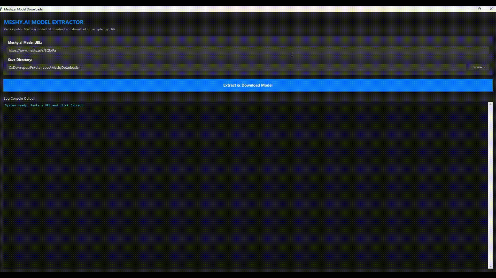
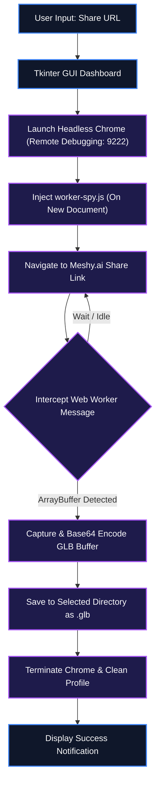

<div align="center">
  <h1>📦 MeshyDownloader</h1>
  <p><strong>Extracts and downloads decrypted `.glb` 3D models directly from public Meshy.ai share links.</strong></p>

  <p>
    <a href="https://www.python.org/"></a>
    <a href="LICENSE"></a>
    <a href="https://pypi.org/project/websockets/"></a>
  </p>
</div>

<p align="center">
  
</p>

> [!IMPORTANT]
> **Platform & Browser Requirement**: Requires Windows 10/11 and Google Chrome installed natively for headless debugging injection.

```bash
# Quickstart — Launch dashboard in 30 seconds
pip install websockets
python meshy_downloader.py
```

**The problem:** Meshy.ai share links restrict raw `.glb` 3D model downloads by encrypting binary payloads and utilizing web worker obfuscation to prevent direct file saving.

**Why MeshyDownloader exists:** I built this tool to bypass anti-bot detection and intercept decrypted 3D model data directly inside the browser's web worker in real-time.

MeshyDownloader provides an automated dark-themed GUI that extracts raw `.glb` files from Meshy.ai share URLs without requiring browser DevTools inspection. It's built for 3D creators and artists — not for general video or web scraping.

<br />

## 📖 Table of Contents
- [What is MeshyDownloader?](#-what-is-meshydownloader)
- [Key Features](#-key-features)
- [System Architecture](#-system-architecture)
- [Setup & Installation](#-setup--installation)
- [How to Use](#-how-to-use)
- [Scope & Limitations](#-scope--limitations)
- [File Structure](#-file-structure)
- [Troubleshooting](#-troubleshooting)
- [Contributing](#-contributing)
- [License](#-license)

---

## 💡 What is MeshyDownloader?

MeshyDownloader is a Windows-based extraction tool designed to securely download `.glb` models from Meshy.ai links without relying on manual browser inspection. It resolves headless browser detection and intercepts the decryption process inside the browser web worker to capture the model file in real-time.

| Before | After |
| :--- | :--- |
| Manually inspecting DevTools network tabs, dumping encrypted `.meshy` blobs, and running manual WASM decrypters. | Paste Meshy.ai URL into MeshyDownloader, click Extract, and receive a clean `.glb` file automatically. |

Instead of manual network inspection and binary decryption:
- **Custom Dark UI**: Provides a modern Tkinter-based dashboard for easy URL input and folder selection.
- **Decrypted GLB Extraction**: Intercepts the decryption logic inside the browser's web worker to extract the raw `.glb` files.
- **Anti-Bot Bypass**: Automatically masks the headless Chrome browser environment to bypass anti-bot challenges.

---

## ✨ Key Features

- 🎨 **Custom Dark UI**: Provides a modern dark-themed user interface built using optimized Tkinter.
- 🔓 **Decrypted GLB Extraction**: Intercepts the decryption logic inside the browser's web worker to extract the raw `.glb` files.
- 🤖 **Anti-Bot Bypass**: Automatically masks the headless Chrome browser environment (clearing the `navigator.webdriver` fingerprint) to bypass anti-bot challenges.
- 📋 **Real-time Log Console**: Monitors network requests, browser messages, and download status in a dedicated logger window.
- ⚡ **Single-Click Installer**: Offers an easy-to-use, pre-packaged Inno Setup installer that handles execution setup on Windows.

---

## ⚙️ System Architecture

The following diagram illustrates the application's headless browser injection and worker-spy pipeline.



---

## 🚀 Setup & Installation

### Option A: 1-Click Setup (Windows Winget)
```shell
winget install --id Python.Python.3.10 -e --accept-source-agreements --accept-package-agreements
winget install --id Git.Git -e --accept-source-agreements --accept-package-agreements
```
This script automates the installation of Python and Git on a clean Windows machine.

### Option B: Manual Installation

```bash
git clone https://github.com/IamOumarIbrahim/MeshyDownloader.git
cd MeshyDownloader
pip install websockets
```

🔍 **Verification Command**:
```bash
python --version
```
*Expected Output*: `Python 3.10.x`

---

## 🖥️ How to Use

1. Launch **MeshyDownloader** from your desktop shortcut or via Python CLI.
2. Paste a public Meshy.ai shared model link (e.g., `https://www.meshy.ai/s/8QkxPa`) in the **Meshy.ai Model URL** field.
3. Select the desired destination folder and click **Extract & Download Model** to begin. The log console will update in real-time as the download finishes.

```bash
# Launch the application interface
python meshy_downloader.py
```

---

## 🔬 Scope & Limitations

- **Platform Requirement**: Currently optimized and tested exclusively for Windows 10/11 environments.
- **Browser Dependency**: Requires Google Chrome to be installed natively for headless debugging injection.

---

## 📁 File Structure

```
MeshyDownloader/
├── assets/
│   └── demo.gif                 - Demo preview animation
├── installer.iss                - Inno Setup compiler configuration
├── meshy_downloader.py          - Main Tkinter GUI application
├── decrypt.js                   - Node.js script to run WASM model decryption locally
├── download_and_inspect.py     - Python script to inspect .meshy encrypted file headers
├── find_button.py               - Script to locate specific UI targets on the page
├── trace_outgoing.py            - Python CLI tool to inspect worker messages in detail
└── README.md                    - Project documentation
```

---

## 🩹 Troubleshooting

| Issue | Root Cause | Resolution |
| :--- | :--- | :--- |
| Download fails immediately | Anti-bot detection active | Ensure Chrome is updated and not running other active debugging sessions. |
| UI freezes on download | Worker interception timeout | Restart the application and verify your network connectivity to Meshy.ai. |

---

## 🧩 Contributing

Contributions are welcome, particularly in adding support for other 3D model sharing platforms or improving the web worker interception logic to be more robust. Feel free to open a pull request or submit an issue.

---

## 📄 License
CC0 1.0 © 2024 [IamOumarIbrahim](https://github.com/IamOumarIbrahim)

<div align="center">

If MeshyDownloader saved you time downloading 3D models, a ⭐ helps other people find it.

</div>
